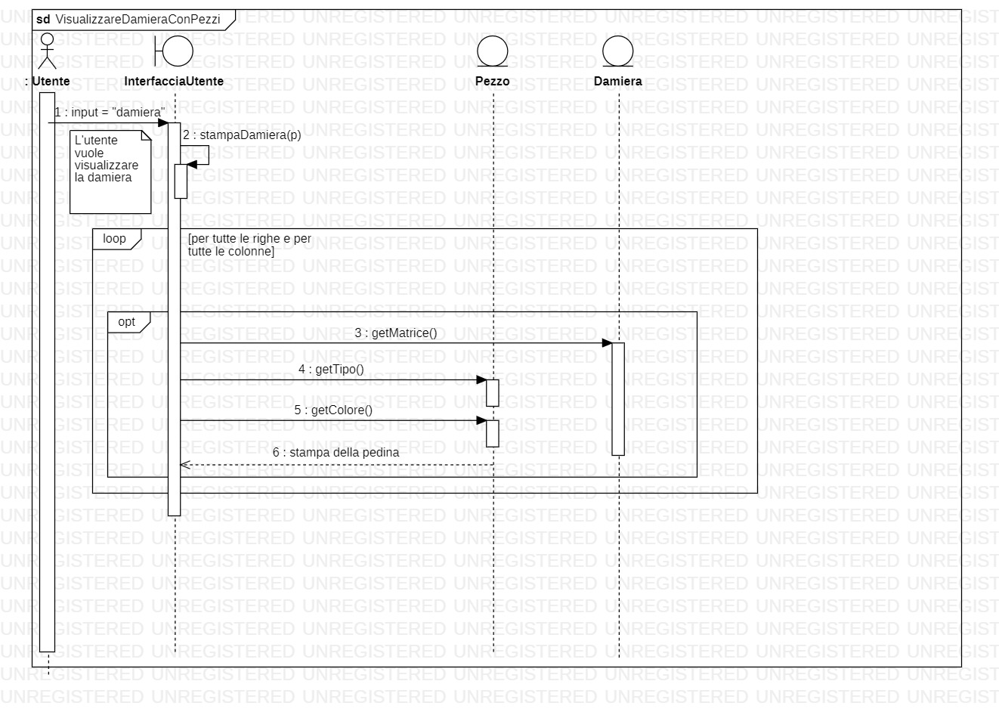

# Report
## Indice
1. [Introduzione](#1-introduzione)
2. [Modello di dominio](#2-modello-di-dominio)
3. [Requisiti specifici](#3-requisiti-specifici)
4. [System Design](#4-system-design)
5. [O-O Design](#5-o-o-design)
6. [Riepilogo del test](#6-riepilogo-del-test)
7. [Manuale utente](#7-manuale-utente)
8. [Processo di sviluppo e organizzazione del lavoro](#8-processo-di-sviluppo-e-organizzazione-del-lavoro)
9. [Analisi retrospettiva](#9-analisi-retrospettiva)
<hr>


## 1. Introduzione
Lo scopo del progetto è stato quello di sviluppare un'applicazione riguardante il gioco della **dama italiana**.
>Il gioco della dama è un gioco di strategia in cui due giocatori giocano uno contro l'altro su una damiera 8x8
>con lo scopo di *"fare dama"* , ovvero le pedine muovono sempre in avanti di una casella, sulle caselle bianche, e quando raggiungono la 
>base avversaria diventano dame. 

Il software è stato interamente sviluppato in Java, in particolare con la JDK 8.
L'applicazione sviluppata dal nostro team (**Glass**) consente di simulare una partita di dama italiana.
Più nel dettaglio, consente di giocare una partita dall'**apertura** fino al **mediogioco**, ossia poter muovere
tutti i pezzi a disposizione sulla damiera, effettuare prese e mosse, ma non concludere la partita.<br>
L'applicazione può essere utilizzata per giocare o simulare una partita di dama, è possibile giocarci in due da uno
stesso dispositivo in grado di eseguirla, oppure singolarmente, interpretando entrambi i giocatori nella partita.<br>

Il nostro team prende il nome di ***Glass***, nome ispirato al software engineer americano 
**Robert L. Glass**.<br>
Noto per i suoi lavori sull'ingegneria del software, Glass ha condotto studi riguardanti la misurazione della qualità della progettazione
del software e lo stato dell'arte della ricerca di ingegneria del software.


I membri del team sono:
 - Giuseppe Monitillo,
 - Rosa Vicenti,
 - Rossella Sgaramella,
 - Vittoria Stella,
 - Vito Vicenti,
 - Giacomo Mauro,
 - Angelo Sorangelo.
 
 
## 2. Modello di dominio
Di seguito è riportato lo schema fatto per il modello di dominio: <br><br>
   <br><br>

## 3. Requisiti specifici

### Requisiti funzionali
Di seguito sono riportati tutti i requisiti funzionali dell'applicazione dama:
 - Iniziare una nuova partita
 - Abbandonare la partita
 - Chiudere il gioco
 - Visualizzare l'elenco dei comandi
 - Visualizzare le mosse giocate
 - Visualizzare le prese effettuate
 - Visualizzare la damiera con numerazione
 - Visualizzare la damiera con i pezzi
 - Visualizzare il tempo di gioco
 - Muovere una pedina (spostamento semplice)
 - Muovere una pedina con presa semplice
 - Muovere una pedina con presa multipla
 - Muovere una pedina con damatura
 
### Requisiti non funzionali

#### Elenco dei terminali supportati
 Di seguito è riportato l'elenco dei terminali su cui poter eseguire il container dell'applicazione dama italiana:
 - Linux
 - terminal Mac OS
 - terminal Windows
 - Terminal del sottosistema Windows per Linux
 - Git Bash (in questo caso il comando Docker ha come prefisso winpty; es: winpty docker -it ....)
 
#### Esecuzione dell'applicazione con Docker
Per poter avviare l'applicazione è necessario innanzitutto eseguire il seguente comando su uno dei terminali appena specificati :<br>
```docker pull docker.pkg.github.com/softeng2021-inf-uniba/progetto2021ter-glass/dama-glass:latest``` <br>
In questo modo avrete scaricato l'immagine dell'applicazione.<br>
Successivamente è necessario effettuare il comando:<br>
```docker run --rm -it docker.pkg.github.com/softeng2021-inf-uniba/progetto2021ter-glass/dama-glass:latest``` <br>
che andrà ad eseguire il container contenente l'applicazione.

## 4. System Design
Per questa applicazione, non si può ampliamente parlare di System Design e stile architetturale 
in quanto non ci sono veri e propri sotto-sistemi che interagiscono fra di loro ma vi è un unico sistema di "dimensioni medio-piccole".

## 5. O-O Design
Di seguito i diagrammi delle classi e i rispettivi diagrammi di sequenza per alcune user story "modello" ritenute più importanti.
### Diagrammi delle classi
#### User Story - Visualizzare la damiera con i pezzi
   
#### User story - Spostare una pedina (spostamento semplice)
   
###  User story - Spostare una pedina con presa semplice
   
### Diagrammi di sequenza
#### User Story - Visualizzare la damiera con i pezzi
   N.B) Si presuppone che la partita sia già in corso
   
###  User Story - Spostare una pedina (spostamento semplice)
   
### User Story - Spostare una pedina con presa semplice
   


### Design Pattern
L'unico design pattern utilizzato nel codice dell'applicazione è ***SINGLETON***.<br>
Infatti come si può vedere, le classi **Partita** e **Damiera** (rispettivamente di tipo Control e Entity nel modello ECB) sono
classi singleton istanziate una sola volta nella InterfacciaUtente.


### Decisioni Prese
Tutte le classi del progetto sono state progettate e realizzate per rispettare i criteri di ECB
e, ovviamente, i criteri della programmazione Object Oriented.
Di seguito una lista delle decisioni fondamentali prese per il progetto:
1. La Damiera è una matrice 8x8 di elementi di tipo Pezzo dove, una casella è occupata se contiene un pezzo, è vuota se il
suo valore è *null*.
2. La classe che si occupa di gestire l'iterazione con l'utente è **InterfacciaUtente** (Boundary), inoltre con il metodo ***Avvia()***
(richiamato da AppMain che ha come solo scopo quello di far partite l'intera applicazione: entry point) viene gestito tutto il
flusso di input e output dell'applicazione, che termina solo con la conferma del comando ***abbandona***.
3. La classe **Pezzo** (Entity) contentiene le informazioni relative il colore e il tipo dei pezzi.
4. La classe **Partita** è quella che contiene tutte le informazioni aggiornate sulla partita in corso:<br>
lo stato della damiera, l'elenco delle mosse giocate, l'elenco delle prese effettutate, il turno attuale.<br>
5. La classe **controlloreMovimento** (Control) che si occupa di effettuare controlli riguardanti il corretto spostamento delle pedine,
in base alle regole del gioco.
Il controlloreMovimento si occupa dunque di:
* convertire un comando di spostamento
* convertire un comando di presa (semplice o multipla)
* verificare che sia il turno del giocatore che sta effettuando la mossa
* verificare che la casella di arrivo della pedina sia libera
* verificare che sia possibile effettuare o meno il comando di spostamento inserito in input
* verificare che sia possibile o meno effettuare uno spostamento con presa semplice
* verificare che sia possibile e sia consentita la presa di una pedina

6. La classe **Spostamento** (Control) che si occupa di eseguire lo spostamento delle pedine sulla damiera, in base al comando impartito.
7. La classe **Tempo** (Control) è utile per gestire la funzionalità del tempo.
8. Sono state create delle classi adibite esclusivamente a contenere valori di **costanti**, questo per rispettare il principio DRY e quindi
non dover ripetere nel codice i valori di queste costanti con rischio di errori. Tra i valori di costanti ci sono quelli associati ai colori
dei giocatori, al tipo del pezzo e alle espressioni regolari.<br>


### 6. Riepilogo del test
Il testing dell'applicazione è stato effettuato conoscendo il comportamento aspettato per poterlo confrontare con il comportamento osservato. I casi di test realizzati coprono tutta l'applicazione, in particolare la parte di gestione della partita.<br>
I test riguardano varie situazioni ambigue in cui si intende effettuare una mossa.<br>
>es: "Provo ad effettuare uno spostamento in orizzontale", "Provo a muovere una pedina in una direzione sbagliata"... <br>


Come criterio di selezione dei casi di test abbiamo utilizzato *white-box* basati sulla percentuale di copertura.<br>
La percentuale di copertura è del 64%. Nonostante tale percentuale risulti relativamente bassa, abbiamo testato tutte le classi ad eccezione delle classi boundary come  *help* e *InterfacciaUtente*, poichè contengono prevalentemente metodi non testabili come le stampe.<br>
Di seguito sono riportate le tabelle che contengono le percentuali di copertura del codice:
 <br><br>
 <br><br>
 <br><br>
 <br><br>
 <br><br>
<br><br>

## 7. Manuale utente
I comandi disponibili per interagire con l'applicazione sono i seguenti:
- ***gioca***: Consente di iniziare una nuova partita, se effettuato a partita in corso verrà  resettata la partita corrente previa messaggio di conferma.
- ***esci***: Consente di concludere una partita e di uscire dall'applicazione, sempre previa conferma dell'utente.<br>
- ***help***: Viene visualizzato l'elenco dei comandi.

#### Comandi eseguibili solo in partita
- ***damiera***: Viene visualizzato lo stato attuale della damiera.
- ***prese***: Viene visualizzato l'elenco dei pezzi mangiati in formato unicode, suddivisi per giocatore.
- ***mosse***: Viene visualizzato l'elenco delle mosse effettuate nel formato a coppie, suddivisi per giocatore.
- ***tempo***: Viene visualizzato il tempo totale impiegato dal giocatore nell'effettuare le mosse.

Nel caso in cui si effettui il comando gioca a partita in corso, viene visulizzato il messaggio che specifica che la partita è già in corso; nel caso in cui si effettui il comando esci o abbandona, a partita in corso, viene richiesta una conferma
che richiede l'input di *"si"* o *"no"*.


#### Notazione algebrica
Le mosse sono espresse in notazione algebrica.<br>
Esempi di notazione algebrica:
1. 1-5
2. 1x10
3. 24x15x6


## 8. Processo di sviluppo e organizzazione del lavoro
Il software è stato sviluppato utilizzando il metodo di sviluppo **Scrum**, un processo di tipo agile basato sulle *iterazioni* dette **Sprint**.<br>
In particolar modo lo sviluppo è stato suddiviso in 4 ***sprint*** aventi ciascuna una durata approssimativa di 2 settimane.<br>
Inizialmente è stato stipulato un Product Backlog contenente tutte le features richieste.
Le priorità  inerenti ad ogni singolo sprint(**Sprint backlog**) sono state stabilite dal Product Owner, il Prof. Lanubile.
In ciascuna iterazione le attività da svolgere sono state suddivise in **issue** assegnate poi ai vari componenti del team. <br>
Inoltre è stato seguito il **github flow**:
* sono state create le issue associate ai vari compiti
* creato un branch associato alla issue
* effettuato commit
* aperto una pull request.

Per l'organizzazione interna al team delle attività  da svolgere, si sono tenute riunioni tramite la piattaforma **Microsoft Teams** con una frequenza di circa 2-3 volte la settimana al fine di valutare la qualità  del lavoro svolto e, giornalmente, tramite dei **daily meeting**.


## 9. Analisi retrospettiva
#### Soddisfatti
Abbiamo molto apprezzato l'utilizzo del metodo di sviluppo agile Scrum, perchè è stato possibile procedere per rilasci frequenti, attraverso i quali è stato possibile apportare miglioramenti in corso d'opera, grazie ai feedback rilasciati.<br>
Nessuno tra noi aveva mai utilizzato un sistema per il controllo di versione come Git, lo abbiamo trovato molto utile perchè ci ha concesso di velocizzare le fasi di sviluppo del software, garantendo la suddivisione equa dei diversi compiti.
#### Insoddisfatti
L'unica difficoltà incontrata è stata sicuramente quella di programmare in Java, non avendo solide conoscenze del linguaggio di programmazione, poichè il corso di MAP è stato svolto nello stesso semestre di questo corso
